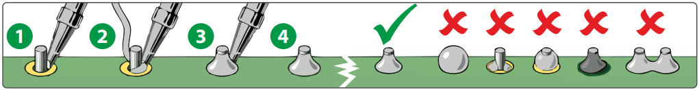
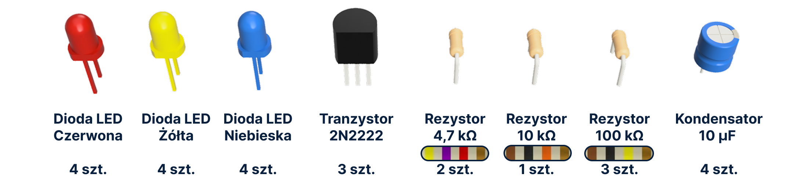
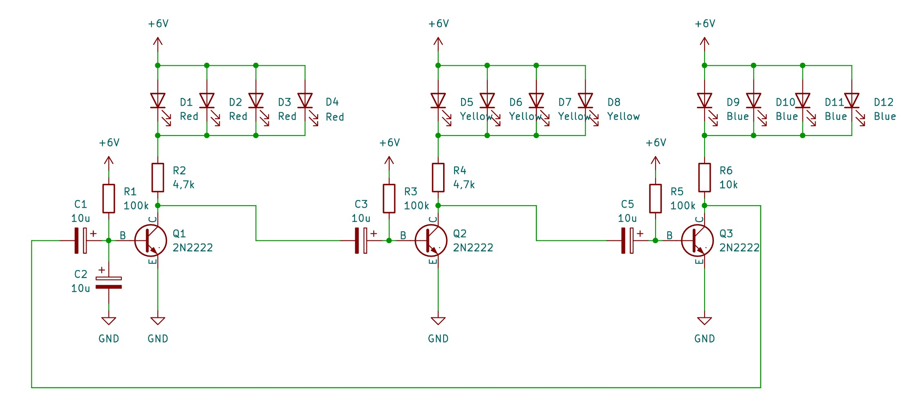

# **Choinka Świąteczna NaMi 🎄 - Instrukcja Montażu**

**Cześć! 👋 Miło Cię tu widzieć!**

**Zapraszamy do odwiedzenia naszych mediów społecznościowych oraz strony internetowej po więcej projektów!**

[ :fontawesome-brands-instagram: Instagram](https://www.instagram.com/nami.pwr/){ .md-button .md-button--outlined .social-button }
[ :fontawesome-brands-github: GitHub](https://github.com/KN-NaMi){ .md-button .md-button--outlined .social-button }
[ :fontawesome-brands-linkedin: LinkedIn](https://www.linkedin.com/company/kn-nami/){ .md-button .md-button--outlined .social-button }

Twoja obecność na tej stronie oznacza, że jesteś szczęśliwym posiadaczem naszego **zestawu DIY**. Poniższa instrukcja przeprowadzi Cię przez proces montażu naszej świątecznej płytki PCB.
Została przygotowana tak, aby była zrozumiała zarówno **dla początkujących, jak i osób, które mają już doświadczenie w montażu elektroniki**.

**⏱️ Całość powinna zająć około 15-20 minut**.

**💡 Poziom trudności: 🟡🟡⚪⚪**

---

## 🧰 **Czego potrzebujesz do montażu?**

- Lutownica  
- Stop lutowniczy 
- Topnik 
- Obcinaczki do wyprowadzeń  
- Opcjonalnie: pęseta, podkładka silikonowa do lutowania

!!! info "Zasilanie"
    Choinka zasilana jest **dwiema bateriami CR2032** - nie są dołączone do zestawu
---

## 📦 **Co znajduje się w zestawie?**

- Nasza autorska płytka PCB w kształcie choinki  
- Zestaw diod LED:  
    - 4x Czerwone
    - 4x Żółte
    - 4x Niebieskie
- 3x Tranzystor
- Zestaw rezystorów
    - 2x Rezystor 470 Ω
    - 1x Rezystor 10 kΩ
    - 3x Rezystor 100 kΩ
- 3x Kondensator 10 μF
- Zmontowana podstawa zasilająca

---

## 🛠️ **Montaż krok po kroku**

### Jak montować układ elektroniczny?

Lutowanie to podstawowa technika łączenia elementów elektronicznych z płytką PCB.
Polega na stopieniu cyny, która dzięki zawartemu w niej topnikowi przylega do pola
lutowniczego oraz do wyprowadzenia elementu. Proces ten nazywa się **zwilżaniem** –
stopiona cyna „oblewa” metalową powierzchnię i tworzy przewodzące połączenie.

Grafika ze strony: <https://serwis.avt.pl/>

!!! warning "Bezpieczeństwo"
    Podczas pracy końcówka lutownicy osiąga temperaturę 250–400°C.
    Pracuj ostrożnie i odkładaj lutownicę na dedykowaną podstawkę.

Dobrze wykonane połączenie lutowane powinno:

- **być gładkie i błyszczące**,  
- **być lekko wklęsłe** (menisk wklęsły),  
- obejmować zarówno pole lutownicze jak i wyprowadzenie,  
- nie mieć nadmiaru cyny (tzw. kulki, mostki lub grudki).

Jeśli cyna nie chce „trzymać się” powierzchni – najczęściej winna jest brudna powierzchnia, tlenki na powierzchni
lub zbyt mała temperatura. W takich sytuacjach pomaga **topnik (flux)**, który usuwa
zanieczyszczenia, poprawiając jakość zwilżania.

!!! tip "W jakiej kolejności montować elementy?"
    Najlepiej zaczynać od **najmniejszych i najniższych elementów**  
    (rezystory → tranzystory → kondensatory → diody LED).  
    Dzięki temu lutowanie jest wygodne i elementy są stabilne.

### Sposób montażu elementów elektronicznych:

!!! danger "Polaryzacja!"
    Niektóre elementy mają **konkretną orientację montażową**, której nie można
    odwrócić. **Błędne podłączenie elementów wymagających odpowiedniej polaryzacji, może skutkować uszkodzeniem elementu!**

!!! step "Krok 1 – Przygotowanie elementów"
    **Rozłóż wszystkie elementy na płaskim podłożu, porównaj z listą z zestawu.**
    
    

    Zdjęcie potrzebnych elementów i płytki PCB
    

    
    **Zapoznaj się z rozmieszczeniem elementów na płytce drukowanej:**

    

!!! step "Krok 2 – Rezystory"
    Włóż odpowiednie rezystory w pola R1–R6, przylutuj zgodnie z powyższą instrukcją, obetnij końcówki. Polaryzacja w przypadku rezystorów nie jest istotna. 
    
    !!! tip
        Rezystory warto montować jako pierwsze — są najmniejsze gabarytowo i można łatwo je ustabilizować. 

     (Widoczne 3 kroki lutowania rezystorów)

!!! step "Krok 3 – Tranzystory"
    Zamontuj tranzystory w Q1–Q3, dopasowując ich kształt do nadruku na płytce PCB. 
    

    

!!! step "Krok 4 – Kondensatory"
    Umieść i przylutuj kondensatory w C1–C5, zwracając uwagę na polaryzację. Obetnij końcówki.
    
    !!! tip
        Kondensatory elektrolityczne zawsze mają zaznaczoną na obudowie polaryzację (minus po stronie jednej z nóżek).

!!! step "Krok 5 – Diody LED"
    Włóż diody według kolorów, pamiętając o dłuższej nóżce jako anodzie (+). Umieszczaj diody zgodnie z opisem kolorów na PCB.

!!! step "Krok 6 – Kontrola i uruchomienie"
    Sprawdź jakość połączeń lutowanych, ponownie zweryfikuj polaryzację wszystkich elementów. Gdy wszystko jest połączone poprawnie, włóż płytkę w podstawę i sprawdź jej działanie.

## 🔍 **Jak to działa? (sekcja dla ciekawych)**

### Schemat elektroniczny

### Jak działa nasz multiwibrator astabilny?

Zastosowany w układzie **trójfazowy multiwibrator astabilny** jest klasycznym
generatorem przebiegów prostokątnych opartym na tranzystorach bipolarnych NPN
(2N2222) oraz sprzężeniu pojemnościowym pomiędzy kolejnymi stopniami.
Każdy tranzystor (Q1, Q2, Q3) steruje oddzielną gałęzią diod LED poprzez
rezystory kolektorowe R2, R4 i R6.

#### Praca tranzystorów i konfiguracja stopni

Każdy stopień pracuje w konfiguracji **wspólnego emitera**, gdzie:

- **emiter** jest połączony bezpośrednio z masą,
- **kolektor** poprzez rezystor obciążenia (4,7 kΩ–10 kΩ) zasila odpowiednie diody LED,
- **baza** sterowana jest poprzez rezystor polaryzujący 100 kΩ oraz impulsowo
  przez kondensator sprzęgający pochodzący z poprzedniego stopnia.

W stanie przewodzenia (nasycenia) tranzystor wymusza niski poziom napięcia na kolektorze,
co umożliwia przepływ prądu przez daną grupę LED. Po wyłączeniu tranzystora
napięcie kolektora wzrasta do poziomu zasilania, wygaszając diody.

#### Sprzężenie między stopniami i generacja oscylacji

Kondensatory **C1, C3 i C5 (10 µF)** pełnią funkcję sprzęgającą — łączą kolektor jednego
stopnia z bazą stopnia następnego. Tworzą razem z rezystorami polaryzującymi (100 kΩ)
układy RC odpowiedzialne za:

- **opóźnienie czasowe przełączenia** (stała czasowa RC),
- **generację impulsu sterującego bazą kolejnego tranzystora**,  
- **samowzbudną oscylację układu** bez konieczności stosowania zewnętrznego sygnału zegarowego.

Mechanizm pracy jednego cyklu można opisać następująco:

1. Załóżmy, że Q1 jest w stanie nasycenia — jego kolektor znajduje się blisko potencjału GND.
2. Kondensator C3 ładuje się zgodnie z równaniem dla obwodu RC, a baza Q2 utrzymywana jest poniżej progu przewodzenia.
3. W momencie rozładowania C3 napięcie bazy Q2 zaczyna rosnąć, aż tranzystor Q2 osiągnie próg przewodzenia i wejdzie w stan nasycenia.
4. Szybki wzrost napięcia na kolektorze Q1 (z LOW do HIGH) jest przeniesiony przez C3 jako impuls dodatni na bazę Q2, przyspieszając jego przełączenie.
5. Analogiczny proces zachodzi pomiędzy parami Q2→Q3 oraz Q3→Q1 poprzez kondensatory C5 i C1.

W efekcie układ przechodzi **cyklicznie przez trzy stabilne stany chwilowe**, z których każdy odpowiada za zaświecenie jednej gałęzi LED.

#### Kolejność przełączeń

Drobne różnice parametrów tranzystorów, rezystorów i kondensatorów powodują, że po
włączeniu zasilania jeden ze stopni jako pierwszy osiąga warunki przewodzenia.
Od tego momentu mechanizm sprzężenia pojemnościowego wymusza następującą sekwencję,
czyli kolejno zapalają się:

- diody czerwone,
- następnie żółte,
- na końcu niebieskie,

a cały cykl powtarza się.

## **❓ Rozwiązywanie problemów**

**LED-y nie świecą**  
– sprawdź poprawność polaryzacji diod  
– sprawdź styki podstawy zasilającej  

**Tylko jedna strona miga**  
– możliwy błąd przy tranzystorze lub kondensatorze w danym ramieniu multiwibratora  

**Choinka w ogóle się nie uruchamia**  
– upewnij się, że baterie są nowe i poprawnie włożone 

---

## **🙌 Podziękowania**

Projekt został zrealizowany przez członków **Koła Naukowego NaMi**  
przy wsparciu **Wydziału Elektroniki, Fotoniki i Mikrosystemów (W12N)**.

Miłego montowania! 🔧🎄
